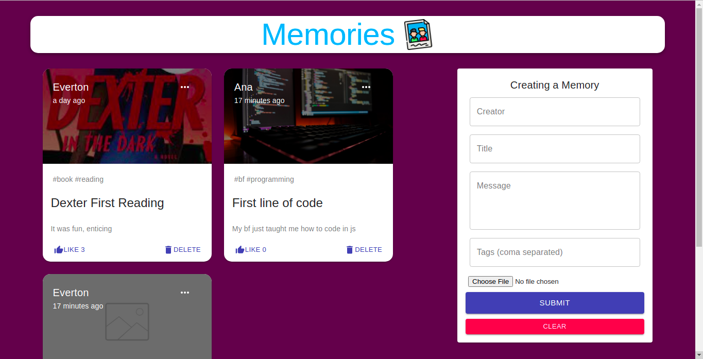
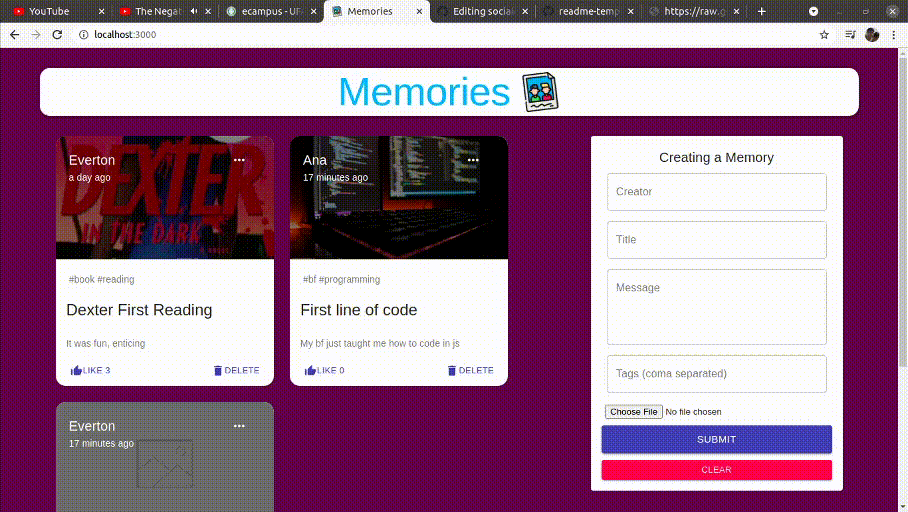

# Memories

<div >
  
  
</div>

> Project developed in Nodejs, React and Mongodb |
> Took this course to improve my knowledge in mongoose library

### Ajustes e melhorias

Project finished, the skills applied in this project are

- [x] Restful API development
- [x] Front end development | HTTP communication
- [x] ORM use in backend applications

## 💻 Requirements

Before you run the project, make sure you check all items:
<!---Estes são apenas requisitos de exemplo. Adicionar, duplicar ou remover conforme necessário--->
* You have installed `nodejs`
* You have installed `yarn package manager`

## 🚀 Installing and running memories:

Linux | Windows:

To install memories, follow these steps:

Backend (server)
```
yarn && yarn server
```

Frontend:
```
yarn && yarn start
```


[⬆ Return to top](#Memories)<br>
